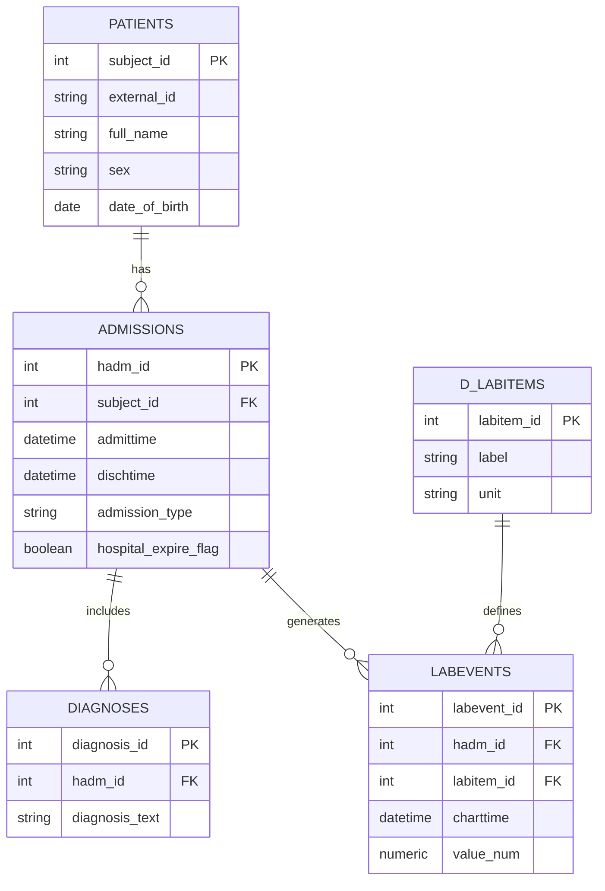

# Laboratorio 01 — Captura en el EHR y Modelos de Datos

**PostgreSQL · Mini-MIMIC** 🏥

En este laboratorio trabajarás con un **modelo simplificado de un Electronic Health Record (EHR)** inspirado en la estructura real de **MIMIC-III**.
El foco **no es análisis**, sino **cómo se capturan y modelan los datos clínicos en la realidad** usando PostgreSQL.

> **Idea central**
> Los datos clínicos no viven en una sola tabla.
> Se capturan como **eventos** que ocurren dentro de **encuentros clínicos (admissions)**.

---

## 🎯 Objetivos de aprendizaje

Al finalizar este laboratorio serás capaz de:

- Diferenciar **paciente** vs **encuentro clínico**
- Entender por qué `admissions` es el **eje del modelo EHR**
- Modelar datos clínicos reales con tablas y relaciones en PostgreSQL
- Ejecutar consultas SQL básicas con sentido clínico
- Trabajar con **checkpoints y commits** como en un entorno profesional

---

## 📐 Esquema mini-MIMIC (subconjunto pedagógico)

Trabajaremos con 5 tablas:

| Tabla        | Qué representa                 |
| ------------ | ------------------------------ |
| `patients`   | Identidad longitudinal         |
| `admissions` | Encuentros hospitalarios (eje) |
| `diagnoses`  | Diagnósticos por admisión      |
| `d_labitems` | Diccionario de laboratorios    |
| `labevents`  | Resultados de laboratorio      |

> 🔑 **Regla de oro**
> Los datos clínicos **cuelgan de la admisión**, no directamente del paciente.

---

## 🌿 Branch del laboratorio

> [!IMPORTANT]
> Este laboratorio **solo se evalúa por Pull Request** desde el branch correcto del grupo.

### 👥 Grupos oficiales

Los grupos ya están definidos:

- **Grupo 1**
- **Grupo 2**
- **Grupo 3**
- **Grupo 4**
- **Grupo 5**
- **Grupo 6**
- **Grupo 7**
- **Grupo 8**

Cada grupo usa **exactamente un branch**.

---

### 📛 Nomenclatura obligatoria del branch

El branch **debe llamarse exactamente** así:

```
lab01-ehr-capture/grupo-<N>
```

Ejemplos válidos:

- `lab01-ehr-capture/grupo-1`
- `lab01-ehr-capture/grupo-4`
- `lab01-ehr-capture/grupo-8`

---

### 🛠️ Crear el branch (paso a paso)

**Una sola persona del grupo** crea el branch y lo comparte.

Desde la raíz del repositorio:

```powershell
git checkout main
git pull
git checkout -b lab01-ehr-capture/grupo-<N>
```

Luego, **todo el grupo trabaja sobre ese mismo branch**.

> [!TIP]
> No crees branches adicionales “por si acaso”.
> **Un grupo = un branch = un PR.**

---

### 🔁 Commits durante el laboratorio

- Los **checkpoints** requieren commits intermedios.
- Esos commits **NO son la entrega**, solo evidencia de progreso.

> [!NOTE]
> Commit ≠ Entrega
> Pull Request = Entrega oficial

---

## 📬 Entrega final (Pull Request)

> [!IMPORTANT]
> La entrega se hace **solo al final**, cuando el docente lo indique.

Pasos finales:

```powershell
git add sql/002_ehr_schema.sql *.ipynb
git commit -m "Lab01: EHR capture model and clinical queries"
git push -u origin lab01-ehr-capture/grupo-<N>
```

Luego, en GitHub:

- **Base:** `main`
- **Compare:** `lab01-ehr-capture/grupo-<N>`
- **NO hacer merge**

Título del PR:

```
Lab01 – EHR Capture – Grupo <N>
```

---

## ⚠️ Checkpoints del laboratorio (léelo antes de empezar)

Este laboratorio se trabaja por **checkpoints**.
No sigas avanzando si no cumples el checkpoint actual.

> [!IMPORTANT]
> Cuando el docente indique una parada, **detente** y verifica tu estado antes de continuar.

### Checkpoint 1 — Infraestructura lista

✔ Docker Desktop corriendo
✔ `docker ps` muestra `db` y `jupyter`
✔ Jupyter abre en el navegador

_(No hay commit en este checkpoint)_

---

### Checkpoint 2 — Modelo EHR creado (commit obligatorio)

✔ Tablas creadas sin errores en PostgreSQL

👉 Commit obligatorio:

```bash
Checkpoint 1: EHR schema created
```

---

### Checkpoint 3 — Datos clínicos capturados (commit obligatorio)

✔ Datos insertados correctamente
✔ No hay errores de `INSERT`

👉 Commit obligatorio:

```bash
Checkpoint 2: sample clinical data inserted
```

---

### Checkpoint 4 — Consulta clínica funcionando

✔ Consulta SQL devuelve una tabla en Jupyter

👉 Commit final del laboratorio (entrega)

---

## 0) Reglas del laboratorio

> [!IMPORTANT]
>
> - Usa el **mismo entorno del Lab 00**
> - **Nunca trabajes en `main`**
> - No instales herramientas nuevas
> - No uses CSV ni Excel
> - Si te atoras, **para y pregunta**

---

## 1) Preparación

### 1.1 Entrar al laboratorio

Desde la raíz del repositorio:

```powershell
cd labs/lab-1-ehr-capture
```

### 1.2 Levantar servicios

```powershell
docker compose up -d
docker ps
```

> [!TIP]
> Si no ves `db` y `jupyter`, **no sigas**. Estás antes del Checkpoint 1.

---

## 🔵 CHECKPOINT 1 — Infraestructura lista

> [!NOTE]
> Si Jupyter abre en `http://localhost:8888`, vas bien.

---

## 2) Crear el modelo EHR en PostgreSQL

### 🧠 Antes de empezar: ¿qué estamos modelando?

Antes de escribir SQL, pensemos en la realidad clínica.

En un hospital:

- Un **paciente** es una persona que existe a lo largo del tiempo.
- Un paciente puede tener **múltiples ingresos al hospital**.
- Cada ingreso es un **encuentro clínico** con inicio y fin.
- Durante un encuentro ocurren **eventos clínicos**:
  diagnósticos, laboratorios, tratamientos.

El diagrama siguiente es un **mapa de esa realidad**:



### 2.1 Crear el archivo SQL

Crea el archivo:

```
sql/002_ehr_schema.sql
```

Contenido:

```sql
-- Patients: identidad longitudinal
CREATE TABLE IF NOT EXISTS patients (
  subject_id SERIAL PRIMARY KEY,
  external_id TEXT UNIQUE,
  full_name TEXT,
  sex CHAR(1) CHECK (sex IN ('M','F','O')),
  date_of_birth DATE,
  date_of_death DATE
);

-- Admissions: encuentros clínicos (eje del modelo)
CREATE TABLE IF NOT EXISTS admissions (
  hadm_id SERIAL PRIMARY KEY,
  subject_id INT REFERENCES patients(subject_id),
  admittime TIMESTAMP,
  dischtime TIMESTAMP,
  admission_type TEXT,
  hospital_expire_flag BOOLEAN
);

-- Diagnoses: diagnósticos por admisión
CREATE TABLE IF NOT EXISTS diagnoses (
  diagnosis_id SERIAL PRIMARY KEY,
  hadm_id INT REFERENCES admissions(hadm_id),
  diagnosis_text TEXT
);

-- Lab dictionary
CREATE TABLE IF NOT EXISTS d_labitems (
  labitem_id SERIAL PRIMARY KEY,
  label TEXT,
  unit TEXT
);

-- Lab events
CREATE TABLE IF NOT EXISTS labevents (
  labevent_id SERIAL PRIMARY KEY,
  hadm_id INT REFERENCES admissions(hadm_id),
  labitem_id INT REFERENCES d_labitems(labitem_id),
  charttime TIMESTAMP,
  value_num NUMERIC
);
```

### 2.2 Ejecutar el SQL

```powershell
Get-Content .\sql\002_ehr_schema.sql | docker compose exec -T db psql -U uvg_user -d health_data
```

---

## 🔵 CHECKPOINT 2 — Modelo EHR creado

> [!IMPORTANT]
> No sigas sin hacer este commit.

```powershell
git add sql/002_ehr_schema.sql
git commit -m "Checkpoint 1: EHR schema created"
```

---

## 3) Simular captura de datos clínicos

Agrega **al final del mismo archivo SQL**:

```sql
-- Patients
INSERT INTO patients (external_id, full_name, sex, date_of_birth) VALUES
('MRN-0001', 'Ana López',       'F', '1980-03-12'),
('MRN-0002', 'Carlos Pérez',    'M', '1975-07-01'),
('MRN-0003', 'María Gómez',     'F', '1992-11-23'),
('MRN-0004', 'José Martínez',   'M', '1968-05-09'),
('MRN-0005', 'Alex Rivera',     'O', '2001-08-14'),
('MRN-0006', 'Lucía Herrera',   'F', '1988-02-02'),
('MRN-0007', 'Miguel Castillo', 'M', '1959-10-30'),
('MRN-0008', 'Sofía Morales',   'F', '1979-06-18');

-- Admissions
INSERT INTO admissions (subject_id, admittime, dischtime, admission_type, hospital_expire_flag) VALUES
-- Ana (2 admisiones)
(1, '2101-01-10 08:00', '2101-01-15 14:00', 'Emergency', false),
(1, '2102-06-01 10:00', '2102-06-05 09:00', 'Elective',  false),

-- Carlos (1 admisión con mortalidad)
(2, '2101-03-20 22:00', '2101-03-28 10:00', 'Emergency', true),

-- María (1 admisión)
(3, '2101-07-11 13:00', '2101-07-14 11:00', 'Urgent',    false),

-- José (1 admisión)
(4, '2101-09-02 06:00', '2101-09-10 15:00', 'Emergency', false),

-- Alex (1 admisión)
(5, '2101-12-18 19:00', '2101-12-22 08:00', 'Emergency', false),

-- Lucía (2 admisiones)
(6, '2101-02-05 09:30', '2101-02-08 10:00', 'Emergency', false),
(6, '2101-11-01 16:00', '2101-11-04 12:00', 'Urgent',    false),

-- Miguel (1 admisión)
(7, '2101-05-14 07:00', '2101-05-20 15:00', 'Emergency', false),

-- Sofía (1 admisión)
(8, '2101-08-21 20:00', '2101-08-24 09:00', 'Emergency', false);

-- Diagnoses
INSERT INTO diagnoses (hadm_id, diagnosis_text) VALUES
(1,  'Hypertension'),
(1,  'Chest pain'),
(2,  'Elective procedure follow-up'),
(3,  'Sepsis'),
(3,  'Acute Kidney Injury'),
(4,  'Asthma exacerbation'),
(5,  'Pneumonia'),
(6,  'Trauma'),
(7,  'Urinary tract infection'),
(8,  'Dehydration'),
(9,  'Heart failure'),
(10, 'Appendicitis');

-- Lab dictionary
INSERT INTO d_labitems (label, unit) VALUES
('Creatinine', 'mg/dL'),
('Hemoglobin', 'g/dL'),
('White Blood Cells', '10^9/L'),
('Platelets', '10^9/L'),
('Lactate', 'mmol/L');

-- Lab events
INSERT INTO labevents (hadm_id, labitem_id, charttime, value_num) VALUES
-- hadm 1 (Ana - Emergency)
(1, 1, '2101-01-11 06:00', 1.1),
(1, 1, '2101-01-13 06:00', 1.6),
(1, 2, '2101-01-11 06:00', 13.2),
(1, 3, '2101-01-11 06:00',  7.8),
(1, 4, '2101-01-11 06:00', 230),

-- hadm 2 (Ana - Elective)
(2, 2, '2102-06-02 07:00', 12.9),
(2, 3, '2102-06-02 07:00',  6.2),
(2, 4, '2102-06-02 07:00', 210),

-- hadm 3 (Carlos - Sepsis + AKI + death)
(3, 5, '2101-03-21 06:30', 3.8),
(3, 3, '2101-03-21 06:30', 18.4),
(3, 1, '2101-03-21 07:00', 2.5),
(3, 1, '2101-03-23 07:00', 3.1),
(3, 2, '2101-03-21 07:00', 10.4),
(3, 4, '2101-03-21 07:00', 120),

-- hadm 4 (María)
(4, 2, '2101-07-12 08:00', 11.5),
(4, 3, '2101-07-12 08:00',  9.1),
(4, 4, '2101-07-12 08:00', 250),

-- hadm 5 (José - Pneumonia)
(5, 3, '2101-09-03 06:30', 14.2),
(5, 2, '2101-09-03 06:30', 12.1),
(5, 5, '2101-09-03 06:30', 2.2),

-- hadm 6 (Alex - Trauma)
(6, 2, '2101-12-19 07:00', 10.8),
(6, 3, '2101-12-19 07:00', 12.5),
(6, 4, '2101-12-19 07:00', 180),

-- hadm 7 (Lucía - UTI)
(7, 1, '2101-02-06 06:00', 0.9),
(7, 3, '2101-02-06 06:00', 11.0),

-- hadm 8 (Lucía - Dehydration)
(8, 1, '2101-11-02 06:00', 1.4),
(8, 1, '2101-11-03 06:00', 1.1),
(8, 3, '2101-11-02 06:00',  8.4),

-- hadm 9 (Miguel - HF)
(9, 1, '2101-05-15 07:00', 1.8),
(9, 2, '2101-05-15 07:00', 12.7),
(9, 3, '2101-05-15 07:00', 10.2),
(9, 4, '2101-05-15 07:00', 160),

-- hadm 10 (Sofía - Appendicitis)
(10, 3, '2101-08-22 06:00', 13.0),
(10, 2, '2101-08-22 06:00', 12.9);
```

Vuelve a ejecutar el archivo SQL.

---

## 🔵 CHECKPOINT 3 — Datos clínicos capturados

```powershell
git add sql/002_ehr_schema.sql
git commit -m "Checkpoint 2: sample clinical data inserted"
```

> [!NOTE]
> Esto **simula captura clínica real**, no carga de datasets.

---

## 4) Consultas desde Jupyter

Abre `connection_test.ipynb`.

> [!IMPORTANT]
> Ejecuta **una consulta a la vez**. Si una falla, no sigas.

### 4.1 “Patient Journey” mínimo: quién es el paciente y cuándo entró/salió

```python
pd.read_sql("""
SELECT
  p.subject_id,
  p.external_id,
  p.full_name,
  a.hadm_id,
  a.admission_type,
  a.admittime,
  a.dischtime,
  a.hospital_expire_flag
FROM patients p
JOIN admissions a ON a.subject_id = p.subject_id
ORDER BY a.admittime;
""", engine)
```

Esto ya te muestra el **eje real**: paciente → admisiones.

---

## 🔵 CHECKPOINT 4 — Consulta funcionando

> [!IMPORTANT]
> Si ves una tabla con `subject_id`, `hadm_id` y fechas, **cerraste el ciclo DB → análisis**.

---

## 5) Consultas guiadas (escritas por ti)

> [!NOTE]
> Aquí ya no copies SQL completo. Escribe tú el query dentro del notebook.

### 5.1 ¿Qué pacientes han tenido **más de una admisión**?

**Pregunta clínica:** “¿Quiénes son los pacientes ‘frecuent flyers’?”

**Pistas:**

- `COUNT(*)`
- `GROUP BY p.subject_id, p.external_id, p.full_name`
- `HAVING COUNT(*) > 1`

**Tu salida debe incluir:**

- `external_id`, `full_name`, `n_admissions`

---

### 5.2 ¿Cuál fue la **duración de estancia** por admisión (en días)?

**Pregunta clínica:** “¿Cuánto tiempo estuvo internado cada encuentro?”

**Pistas (Postgres):**

- `EXTRACT(EPOCH FROM (dischtime - admittime)) / 86400.0`
- alias: `length_of_stay_days`
- ordena de mayor a menor

**Tu salida debe incluir:**

- `hadm_id`, `external_id`, `full_name`, `length_of_stay_days`

---

### 5.3 “Eventos” de laboratorio: **peak creatinine** por admisión

**Pregunta clínica:** “¿En qué admisiones hubo peor función renal?”

**Pistas:**

- JOIN `labevents` + `d_labitems`
- filtra `d_labitems.label = 'Creatinine'`
- `MAX(value_num)` por `hadm_id`
- une a `admissions` y `patients` para dar contexto

**Tu salida debe incluir:**

- `hadm_id`, `external_id`, `full_name`, `max_creatinine`

---

### 5.4 Sepsis proxy: **WBC alto o lactato alto** por admisión

**Pregunta clínica:** “¿Qué admisiones parecen más severas?”

**Definición simple para el lab (no clínica real):**

- WBC > 12 **o** Lactate > 2

**Pistas:**

- filtra `label IN ('White Blood Cells','Lactate')`
- usa `MAX(CASE WHEN ... THEN value_num END)` para pivotear por admisión
- luego filtra por umbrales

**Tu salida debe incluir:**

- `hadm_id`, `external_id`, `full_name`, `max_wbc`, `max_lactate`

---

👉 Commit final (entrega):

```powershell
git add *.ipynb
git commit -m "Checkpoint 3: clinical queries running in Jupyter"
```

## 6) Reflexión (responde en el PR)

1. ¿Por qué `labevents` cuelga de `hadm_id` y no de `subject_id`?
2. ¿Qué representa `hadm_id` clínicamente (en una frase)?
3. ¿Por qué existe `d_labitems`? ¿Qué problema resuelve?
4. Si tuvieras una sola tabla gigante, ¿qué se volvería difícil: **actualizar** o **consultar**? Explica con un ejemplo.

---

## 7) Entrega (Pull Request)

```powershell
git checkout main
git pull
git checkout -b lab01-ehr-capture/grupo-XX
git add sql/002_ehr_schema.sql *.ipynb
git commit -m "Lab01: EHR capture model and clinical queries"
git push -u origin lab01-ehr-capture/grupo-XX
```

- Base: `main`
- Compare: `lab01-ehr-capture/grupo-XX`
- **No hacer merge**

---

## ✅ Checklist final

- [ ] Checkpoint 1 completo
- [ ] Checkpoint 2 + commit
- [ ] Checkpoint 3 + commit
- [ ] Consulta clínica funciona
- [ ] PR abierto

---
